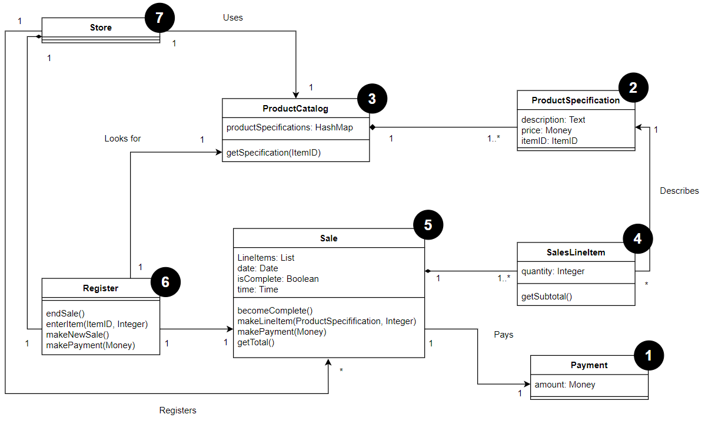
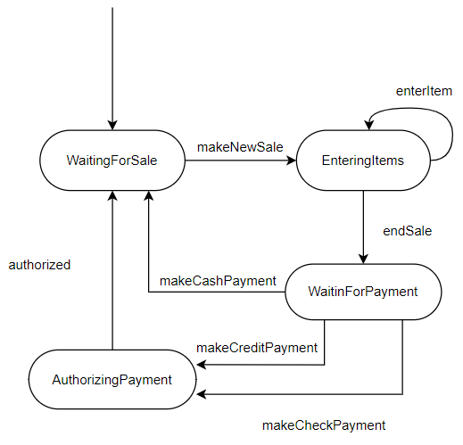
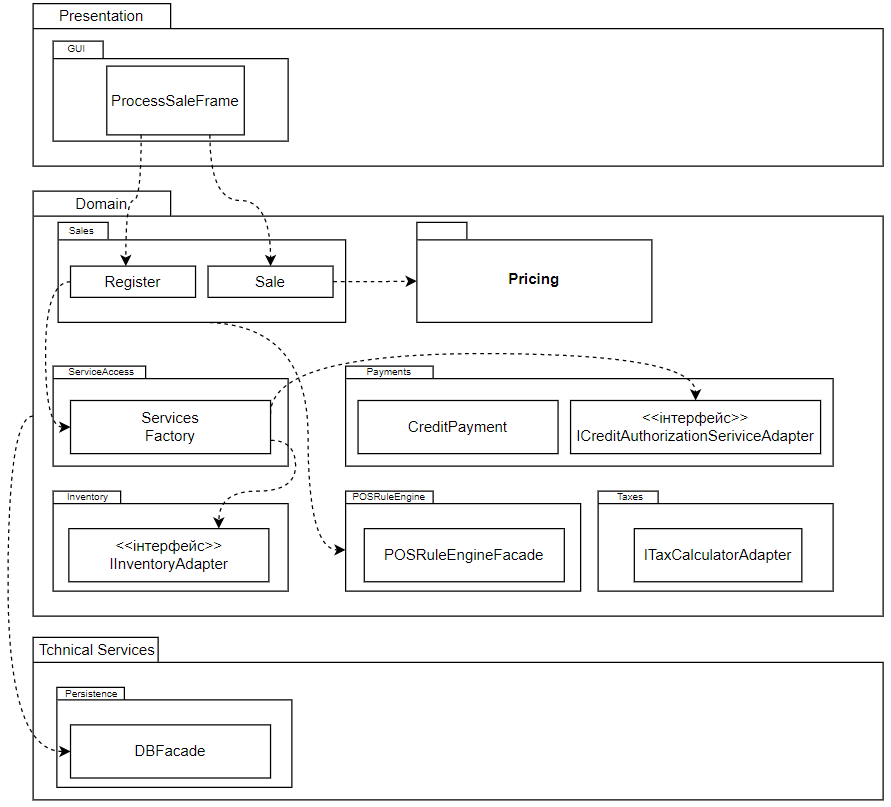

# IOO
Система автоматизації торгівлі
# Про розробників
|Група|ПІБ|Телеграм|Пошта|
|-----|---|-|-|
|ІО-11|Грень Ірина Сергіївна     |@IrinaGren|gren.ira10@gmail.com|
|ІО-11|Лоханько Ксенія Вікторівна|@mavpenyatko_K|kseniyalah@gmail.com|
|ІО-11|Сірук Вікторія Вікторівна |@Viktoriasiruk|viktoriasiruk46@gmail.com|
|ІО-11|Сенюк Єгор Олександрович  |@YehorSeniuk|seniuk.yehor@gmail.com|
---
# Короткий зміст

[1. Аналіз](#1)  
    [1.1 Опис прцедентів](#1.1)  
    [1.2 Діаграми прецедентів](#1.2)  
    [1.3 Модель предметної області](#1.3)  
    [1.4 Модель прецедентів. Опис системних подій](#1.4) 

[2. Проектування](#2) 
    [2.1 Діаграми взаємодії](#2.1) 
    [2.2 Діаграми класів](#2.2)  
    [2.3 Діаграми станів](#2.3)  
    [2.4 Діаграми зв'язку пакетів](#2.4)  

[3. Програмна реалізація](#3)  

---
# <a name="1">1. Аналіз</a>
## <a name="1.1">1.1 Опис перецедентів</a>
><b>Основний актор.</b> Касир 
><b>Зацікавлені особи та їх вимоги</b> 
> - Касир. Хоче точно та швидко ввести дані, без помилок в оплаті, інакше недостача буде вирахувана з його зарплати.
> - Продавець. Хоче отримати свої комесійні.
> - Покупець. Хоче купити товар швидко та з мінімальними зусиллями. Хоче отримати підтвердження факту покупки для можливого повернення товару.
> - Компанія. Хоче записати транзакцію і задовільнити потреби покупця. Хоче впевнетись, що служба авторизації платежів зафіксувала ус дані про платіж.
> Зацікавлена в забезпечені стійкості до збоїв. Хоче продовжувати реєструвати продажи, навіть якщо серверні компоненти недоступні. Хоче автоматично
> оновлювати бухгалтерську документацію і вести складський контроль.
> - Державна податкова служби. Хочуть отримувати податок від кожного продажу.

>  <b>Передумови.</b> Касир індентифікован та аутентифікован. 

> <b>Постумови.</b> Дані о продажу збережені. Податок вирахувано коректно. Бухгалтерські та складські дані оновлені. Комісійні нараховані. Авторизація платежу виконана. 
> 
> <b>Основний сценарій (успішний сценраій)</b>
> 1. Покупець підходить к касовому апарату POS-системи із обраними товарами.
> 2. Касир відкриває новий продаж.
> 3. Касир вводить ідентифікатор товару.
> 4. Система записує наіменування товару і видає його опис, ціну і загальну вартість. Ціна вираховується на основі правил. 
><i>Касир повторює дії, описані в пп. 3-4, для кожного наіменуваня товару.</i>
> 5. Система вираховує загальну вартість покупки з податком.
> 6. Касир повідомляє покупцю загальну вартість із податком і пропонує сплатити покупку.
> 7. Покупець сплачує покупку, система обробляє платіж.
> 8. Система реєструє продаж і відправляє інформацію про неї зовнішній бухгалтерскій системі і системі склдського контролю.
> 9. Система видає товарний чек
> 10. Покупець покидає магазин із чеком та товаром. 
> 
> <b>Розширення (альтернативні сценарії)</b>
> 
> 3а. Неправильний ідентифікатор  
> 3б. В рамках однієї категорії існує декілька різних наіменувань товару. 
> 3-6а. Покупець просить касира відмінити покупку одного з товарів.  
> 3-6б. Покупець просить касира відмінити продаж.  
> 3-6в. Касир призупиняє продаж.  
> 4а. Згенерована системою ціна товару не влаштовує покупця.  
> 5а. Система виявляє сбой при комунікації із зовнішньою службою вирахування податку.  
> 5б. Покупець повідомляє про належну йому знижку.  
> 6а. Покупець повідомляє, що хоче сплатити покупку   
## <a name="1.2">1.2 Діаграми прецедентів</a>
</img>
## <a name="1.3">1.3 Модель предметної області</a>
</img>
## <a name="1.4">1.4 Модель прецедентів. Опис системних подій</a>
|Операція|makeNewSale()|
|--------|-------------------------------------------|
|Посилання|Прецедент: Оформлення продажу|
|Передумови|Відсутні|
|Постумова|Створен екземпляр s класу Sale (створення екземпляру)|
||Екземпляр Sale зв'язан з об'єктов Register (формуваня асоціації)|
||Ініціалізовані атрибути екземпляру s (модифікація атрибуту)|

|Операція|enterItem(itemID: ItemID, quantity: integer)|
|--------|-------------------------------------------|
|Посилання|Прецедент: Оформлення продажу|
|Передумови|Ініціалізован продаж|
|Постумова|Створен екземпляр sli класу SaleLineItem (створення екземпляру)|
||Екземпляр sli зв'язан с поточним екземпляром класу Sale (формування асоціації)|
||Атрибуту sli.quantity присвоєно значення quantity (модифікація атрибута)|
||Екземляр sli зв'язано з класом ProductDpecififcation наоснові відповідності ідентифікатора товара itemID (формування асоціації)|

|Операція|endSale()|
|--------|-------------------------------------------|
|Посилання|Прецедент: Оформлення продажу|
|Передумови|Ініціалізован продаж|
|Постумова|Атрибуту Sale.iscomplete присвоєно значення true (модифікація атрибуту)|

|Операція|makePayment(amount: Money)|
|--------|-------------------------------------------|
|Посилання|Прецедент: Оформлення продажу|
|Передумови|Ініціалізован продаж|
|Постумова|Створен екземпляр p класа Paymen (створення екземпляру)|
||Атрибуту p.amountTendered присвоєно значення amount (модифікація атрибуту)|
||Екземпляр p зв'язан з поточним екземпляром класу Sale (формування асоціації)|
||Поточний екземпляр Sale зв'язан з екземпляром класу Store для його додавання в журнал реєстрації продажів (формування асоціації)|

---
# <a name="2">2. Проектування</a>
## <a name="2.1">2.1 Діаграми взаємодії</a>
## <a name="2.2">2.2 Діаграма класів</a>
</img>
## <a name="2.3">2.3 Діаграма станів</a>
</img>
## <a name="2.4">2.4 Діаграма зв'язку пакетів</a>
</img>
---
## <a>3.Програмна реалізація</a>
