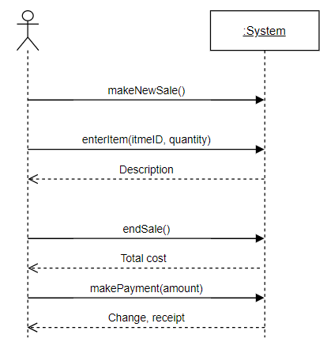
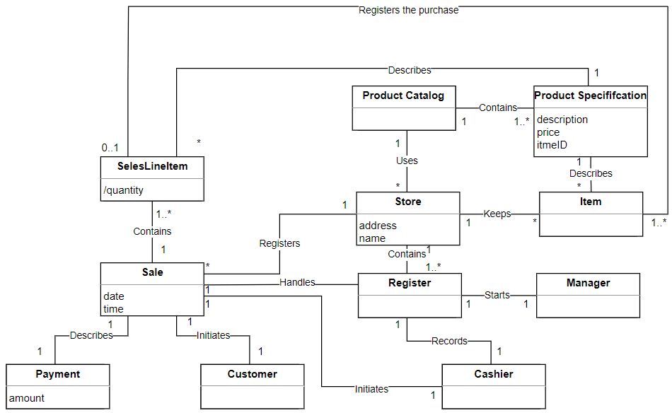

# IOO
Система автоматизації торгівлі
# Про розробників
|Група|ПІБ|Телеграм|Пошта|
|-----|---|-|-|
|ІО-11|Грень Ірина Сергіївна     |@IrinaGren|gren.ira10@gmail.com|
|ІО-11|Лоханько Ксенія Вікторівна|@mavpenyatko_K|kseniyalah@gmail.com|
|ІО-11|Сірук Вікторія Вікторівна |@Viktoriasiruk|viktoriasiruk46@gmail.com|
|ІО-11|Сенюк Єгор Олександрович  |@YehorSeniuk|seniuk.yehor@gmail.com|
---
# Короткий зміст

[1. Аналіз](#1)  
    [1.1 Опис прцедентів](#1.1)  
    [1.2 Діаграми прецедентів](#1.2)  
    [1.3 Модель предметної області](#1.3)  
    [1.4 Модель прецедентів. Опис системних подій](#1.4) 

[2. Проектування](#2) 
    [2.1 Діаграми взаємодії](#2.1) 
    [2.2 Діаграми класів](#2.2)  
    [2.3 Діаграми станів](#2.3)  
    [2.4 Діаграми зв'язку пакетів](#2.4)  

[3. Програмна реалізація](#3)  

---
# <a name="1">1. Аналіз</a>
## <a name="1.1">1.1 Опис перецедентів</a>
## <a name="1.2">1.2 Діаграми прецедентів</a>
</img>
## <a name="1.3">1.3 Модель предметної області</a>
</img>
## <a name="1.4">1.4 Модель прецедентів. Опис системних подій</a>
|Операція|makeNewSale()|
|--------|-------------------------------------------|
|Посилання|Прецедент: Оформлення продажу|
|Передумови|Відсутні|
|Постумова|Створен екземпляр s класу Sale (створення екземпляру)|
||Екземпляр Sale зв'язан з об'єктов Register (формуваня асоціації)|
||Ініціалізовані атрибути екземпляру s (модифікація атрибуту)|

|Операція|enterItem(itemID: ItemID, quantity: integer)|
|--------|-------------------------------------------|
|Посилання|Прецедент: Оформлення продажу|
|Передумови|Ініціалізован продаж|
|Постумова|Створен екземпляр sli класу SaleLineItem (створення екземпляру)|
||Екземпляр sli зв'язан с поточним екземпляром класу Sale (формування асоціації)|
||Атрибуту sli.quantity присвоєно значення quantity (модифікація атрибута)|
||Екземляр sli зв'язано з класом ProductDpecififcation наоснові відповідності ідентифікатора товара itemID (формування асоціації)|

|Операція|endSale()|
|--------|-------------------------------------------|
|Посилання|Прецедент: Оформлення продажу|
|Передумови|Ініціалізован продаж|
|Постумова|Атрибуту Sale.iscomplete присвоєно значення true (модифікація атрибуту)|

|Операція|makePayment(amount: Money)|
|--------|-------------------------------------------|
|Посилання|Прецедент: Оформлення продажу|
|Передумови|Ініціалізован продаж|
|Постумова|Створен екземпляр p класа Paymen (створення екземпляру)|
||Атрибуту p.amountTendered присвоєно значення amount (модифікація атрибуту)|
||Екземпляр p зв'язан з поточним екземпляром класу Sale (формування асоціації)|
||Поточний екземпляр Sale зв'язан з екземпляром класу Store для його додавання в журнал реєстрації продажів (формування асоціації)|

---
# <a name="2">2. Проектування</a>
## <a name="2.1">2.1 Діаграми взаємодії</a>
## <a name="2.2">2.2 Діаграма класів</a>
</img>
## <a name="2.3">2.3 Діаграма станів</a>
</img>
## <a name="2.4">2.4 Діаграма зв'язку пакетів</a>
</img>
---
## <a>3.Програмна реалізація</a>
